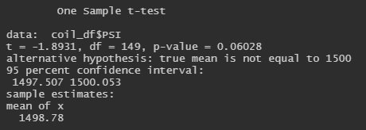
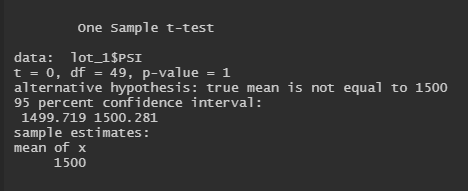
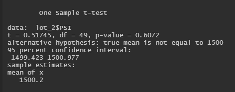
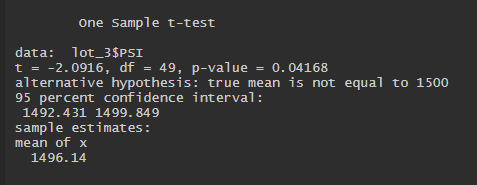

# MechaCar_Statistical_Analysis

This analysis uses mpg test results and suspension coil data to analyze MechaCars' vehicle performance and manufacturing consistency.

## Linear Regression to Predict MPG

#### Variance
According to our summary linear regression model (as shown in the following image) the vehicle length and ground clearance variables are statistically unlikely to contribute random amounts of variance to the mpg values in the dataset. This is because their values are very low (vehicle length = 2.60e-12 and ground clearance = 5.21e-8). This means that the vehicle length and ground clearance have a significant impact on the mpg of the vehicle.

#### Slope
Our p-value is 5.35e-11 which is significantly below the significant level of 0.05%. Since the null hypothesis states that the linear regression model would have a slope of zero, our p-value is enough to reject this hypothesis. Meaning that our linear model does not have a slope of zero.

#### Predictability
Our r-squared value is 0.7149. Since the r-squared value represents how closely our linear regression model approximates the real data points, we can assume that our model approximates about 71% of the variability.

Combining our p-value and r-squared value, we can conclude that there is a significant relationship between mpg and the vehicle length, vehicle weight, spoiler_angle, ground_clearance, and AWD.

## Summary Statistics on Suspension Coils

MechaCar's design specifications dictate that the variance of the suspension coils must remain below 100 lbs per square inch. We can see in the following table that the variance of the total sample data is 62.29 lbs per square inch. Thus the total sample passes.

However, when we look at the sample data divided by each Manufacturing Lot, we can see that Lot 1 and Lot 2 pass (with variance at 0.98 and 7.47, respectively), while Lot 3 fails (with variance at 170.29).

## T-Tests on Suspension coils
- briefly summarize your interpretation and findings for the t-test results. Include screenshots of the t-test to support your summary.

If the p-value is below our significance level of 0.05% we can reject the null hypothesis (that there is no statistical difference between the observed sample mean and its presumed population mean).

In our t-test of the total sample population, our p-value ended up being 0.06. This is not enough to reject the null hypothesis, so we can assume that it holds true here.

For the Lot 1 t-test, the p-value was 1. Since this was also greater than the 0.05% significance level, we can not reject the null hypothesis for Lot 1 values.

Similarly, for Lot 2, the p-value is 0.61. Again, not enough to reject the null hypothesis.

Alternatively, for Lot 3, our p-value was 0.04. This is enough to reject the null hypothesis.

All in all, all populations excluding the Lot 3 sample, proved to have no statistical difference between the sample mean and population mean. Lot 3 proved there is a statistical difference between the two.

## Study Design: MechaCar vs. Competition
Another statistical study that could interest consumers, would be how MechaCars vehicles have improved their safety ratings as the years go by, compared to the company's competitors.

This study would be proving one of the following hypotheses:
  - Null Hypothesis: There is no statistical relationship between safety rating and year of vehicle production.
  - Alternative Hypothesis: There is a statistical relationship between safety rating and year of vehicle production.

To conduct this study, a linear regression model could be conducted, using safety rating data for MechaCars' vehicles and competitor vehicles over the last 20 years (for example). A linear regression model would show if there is a positive or negative correlation to whether vehicles are becoming safer or not. Alternatively, there could be no clear correlation. Benefits of the linear regression model include being able to produce a graph (something most consumers would be able to understand), as well including a p-value and r-squared value. These two values can be used to better understand how representative the linear regression model is of the whole dataset.
