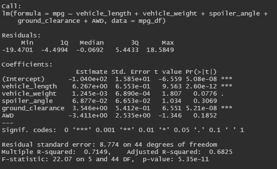

# MechaCar_Statistical_Analysis

This analysis uses mpg test results and suspension coil data to determine whether...

## Linear Regression to Predict MPG

#### Variance
According to our summary linear regression model (as shown in the following image) the vehicle length and ground clearance variables are statistically unlikely to contribute random amounts of variance to the mpg values in the dataset. This is because their values are very low (vehicle length = 2.60e-12 and ground clearance = 5.21e-8). This means that the vehicle length and ground clearance have a significant impact on the mpg of the vehicle.

#### Slope
Our p-value is 5.35e-11 which is significantly below the significant level of 0.05%. Since the null hypothesis states that the linear regression model would have a slope of zero, our p-value is enough to reject this hypothesis. Meaning that our linear model does not have a slope of zero.

#### Predictability
Our r-squared value is 0.7149. Since the r-squared value represents how closely our linear regression model approximates the real data points, we can assume that our model approximates about 71% of the variability.

Combining our p-value and r-squared value, we can conclude that there is a significant relationship between mpg and the vehicle length, vehicle weight, spoiler_angle, ground_clearance, and AWD.

## Summary Statistics on Suspension Coils

MechaCar's design specifications dictate that the variance of the suspension coils must remain below 100 lbs per square inch. We can see in the following table that the variance of the total sample data is 62.29 lbs per square inch. Thus the total sample passes.

However, when we look at the sample data divided by each Manufacturing Lot, we can see that Lot 1 and Lot 2 pass (with variance at 0.98 and 7.47, respectively), while Lot 3 fails (with variance at 170.29).

## T-Tests on Suspension coils
- briefly summarize your interpretation and findings for the t-test results. Include screenshots of the t-test to support your summary.

## Study Design: MechaCar vs. Competition
- Write a short description of a statistical study that can quantify how the MechaCar performs against the competition. In your study design, think critically about what metrics would be of interest to a consumer: for a few examples, cost, city or highway fuel efficiency, horse power, maintenance cost, or safety rating.
  - What metric or metrics are you going to test?
  - What is the null hypothesis or alternative hypothesis?
  - What statistical test would you use to test the hypothesis? And why?
  - What data is needed to run the statistical test?
